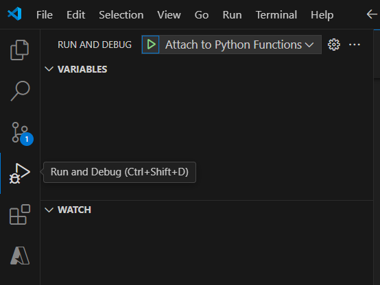

# LLMHub API Setup Documentation

This guide provides step-by-step instructions to set up the LLMHub API repository for development. Follow these steps to create and activate a Python virtual environment, install dependencies, configure environment variables, and get started with the project.

## Prerequisites

- **Python 3.11+** installed on your system.
- **pip** (Python package installer).
- **git** (to clone the repository, if needed).

## Setup Instructions

### 1. Clone the Repository

Clone the repo and navigate into the project directory:

```bash
git clone https://github.com/LLmHub-dev/llmhub-api.git
cd llmhub-api
```

### 2. Create a Virtual Environment

Create an isolated Python environment by running:

```bash
python -m venv .venv
```

This will create a new directory named `venv` that holds your virtual environment.

### 3. Activate the Virtual Environment

Activate the virtual environment using the appropriate command for your operating system:

- **On macOS/Linux:**

  ```bash
  source .venv/bin/activate
  ```

- **On Windows:**

  ```bash
  .venv\Scripts\activate
  ```

After activation, your command prompt should show the name of the virtual environment (typically `(venv)`).

### 4. Install Dependencies

With the virtual environment activated, install all required dependencies using the provided `requirements.txt`:

```bash
pip install -r requirements.txt
```

### 5. Configure Environment Variables

The project includes an example environment file named `.env.example`. Rename this file to `.env`:


**Important:** After renaming, please contact the project admin to obtain the required credentials and insert them into the `.env` file.

### 6. Run API Locally

### Install Azure Functions VSCODE Extension

Go to the run debug tab as show in the image below on the left sidebar or hit ``ctrl+shift+d`` and then click the green play button as seen in the image below to run the image below and voila you have started your API locally!



### 7. Ready to Go!

With the environment set up and dependencies installed, you’re ready to start the API. For example, if your main entry point is `app.py`, you can run:

```bash
python app.py
```

---

## Additional Notes

- **Security:** Keep your `.env` file secure. Do not commit sensitive credentials to version control.
- **Troubleshooting:** If you encounter any issues, double-check that the virtual environment is activated and that all dependencies have been installed correctly.
- **Further Information:** For more details, refer to the project documentation or contact your project admin.

Enjoy working with LLMHub API!

---

This documentation ensures that anyone cloning your repository knows exactly how to set up their environment and get the project running quickly.